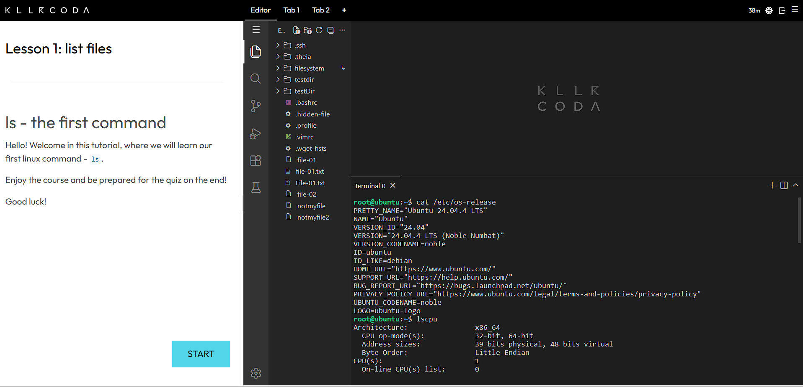

# Laboratory 03 – Multi-Cloud Explorer

## Mission 3: Become a Multi-Cloud Explorer

Student: Fritz Russell Daus

Course: BS-IT

Laboratory: Cloud Computing

Activity: Laboratory Activity 3

## Mission Overview
This laboratory activity explores three major cloud platforms: Amazon Web Services (AWS), Microsoft Azure, and Google Cloud Platform (GCP).

The purpose of this activity is to research their services, compare their features, recommend suitable cloud platforms for different business situations, and investigate a Linux environment using KillerCoda.

## Cloud Platforms

- Amazon Web Services (AWS)
- Microsoft Azure
- Google Cloud Platform (GCP)

## Linux Investigation

The Linux server information collected from KillerCoda will be documented here.

### Cloud Services That Can Host a Linux Server

| Cloud Provider | Virtual Machine Service |
|---|---|
| AWS | Amazon EC2 |
| Microsoft Azure | Azure Virtual Machines |
| Google Cloud | Compute Engine |

## Screenshots

Screenshots and evidence for this laboratory activity will be stored in the `screenshots` folder.

---

## Checkpoint 7 – Linux Investigation

### KillerCoda Linux Server Information

The Linux environment was investigated using the KillerCoda Playground. The following information was collected from the terminal.

| Information | Result |
|---|---|
| Operating System | Ubuntu 24.04.4 LTS |
| Architecture | x86_64 |
| CPU | Intel Xeon E312xx (Sandy Bridge, IBRS update) |
| CPU Count | 1 |
| Memory | 1.9 GiB |
| Disk Space | 19 GB |
| Disk Used | 5.4 GB |
| Disk Available | 13 GB |

### Linux Commands Used

The following commands were used to collect the server information:

bash
cat /etc/os-release

lscpu

free -h

df -h

### KillerCoda Screenshot

The screenshot below shows the Linux terminal and the commands used to collect the server information.

