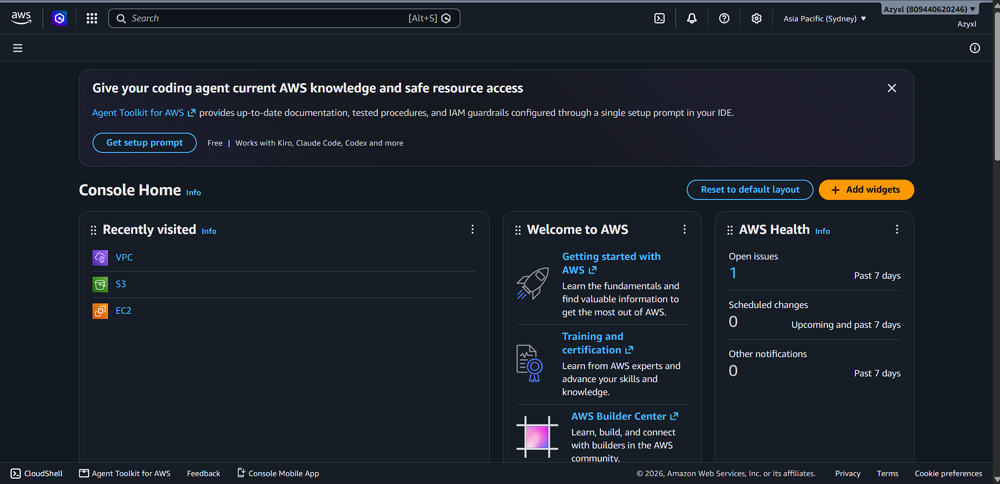

# AWS Research

## Brief Overview

Amazon Web Services (AWS) is a cloud computing platform provided by Amazon. It provides many cloud services that organizations can use for computing, storage, databases, networking, security, and other IT needs.

## Global Infrastructure

AWS has a global infrastructure made up of Regions and Availability Zones. This allows businesses to deploy their applications in different locations around the world and improve availability and performance.

## Cloud Management Console

The AWS Management Console is a web-based interface that allows users to create, configure, monitor, and manage AWS cloud services.

## Four Core Services

### 1. Amazon EC2

Amazon EC2 provides virtual servers that can be used to run applications and websites.

### 2. Amazon S3

Amazon S3 is an object storage service used to store files, images, videos, backups, and other data.

### 3. Amazon VPC

Amazon VPC provides a private network environment where AWS resources can communicate securely.

### 4. AWS IAM

AWS IAM manages users, permissions, and access to AWS resources.

## Three Advantages

1. AWS provides a wide range of cloud services.
2. AWS has a large global infrastructure.
3. AWS resources can scale based on business requirements.

## Typical Enterprise Use Cases

AWS can be used for websites, mobile applications, databases, backups, enterprise applications, data processing, and other business systems.

## Screenshot

