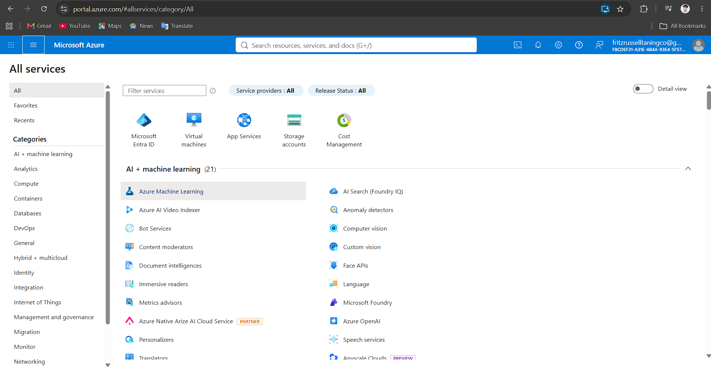

# Microsoft Azure Research

## Brief Overview

Microsoft Azure is a cloud computing platform developed by Microsoft. It provides cloud services for computing, storage, databases, networking, security, artificial intelligence, and application development.

## Global Infrastructure

Azure has a global infrastructure made up of regions and data centers. Organizations can deploy their applications and services in different locations depending on their requirements.

## Cloud Management Console

The Azure Portal is a web-based management interface used to create, configure, monitor, and manage Azure resources and services.

## Four Core Services

### 1. Azure Virtual Machines

Azure Virtual Machines provide virtual computers that can run operating systems and applications in the cloud.

### 2. Azure Blob Storage

Azure Blob Storage is an object storage service used to store files, images, videos, backups, and other unstructured data.

### 3. Azure Virtual Network

Azure Virtual Network allows Azure resources to communicate with each other through a private and secure network.

### 4. Microsoft Entra ID

Microsoft Entra ID provides identity and access management for users, applications, and cloud resources.

## Three Advantages

1. Azure works well with Microsoft technologies.
2. Azure provides many services for businesses and organizations.
3. Azure supports hybrid cloud environments.

## Typical Enterprise Use Cases

Azure can be used for business applications, websites, virtual machines, databases, Microsoft-based systems, artificial intelligence, data analytics, and hybrid cloud environments.

## Screenshot

