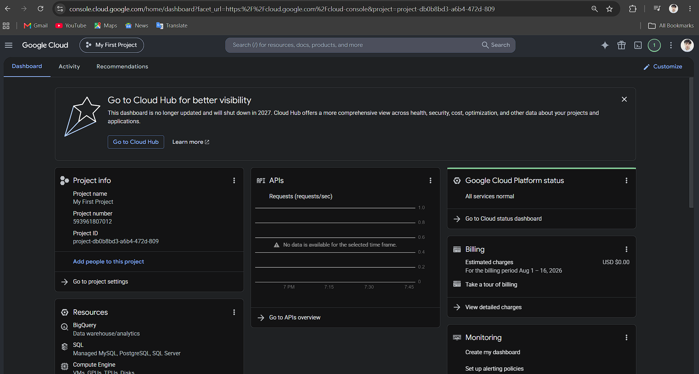

# Google Cloud Platform Research

## Brief Overview

Google Cloud Platform (GCP) is a cloud computing platform developed by Google. It provides cloud services for computing, storage, databases, networking, artificial intelligence, machine learning, and application development.

## Global Infrastructure

Google Cloud has a global infrastructure that allows organizations to deploy applications and services in different regions around the world. This helps businesses serve users from different locations.

## Cloud Management Console

Google Cloud Console is a web-based interface used to create, configure, monitor, and manage Google Cloud resources and services.

## Four Core Services

### 1. Compute Engine

Compute Engine provides virtual machines that can be used to run applications and workloads in the cloud.

### 2. Cloud Storage

Cloud Storage is an object storage service used to store files, images, videos, backups, and other data.

### 3. Google Cloud VPC

Google Cloud VPC provides networking for cloud resources and allows them to communicate securely.

### 4. Google Kubernetes Engine

Google Kubernetes Engine (GKE) is a managed Kubernetes service used to deploy and manage containerized applications.

## Three Advantages

1. Google Cloud has strong artificial intelligence and machine learning capabilities.
2. Google Cloud provides strong Kubernetes support.
3. Google Cloud has a global cloud infrastructure.

## Typical Enterprise Use Cases

Google Cloud can be used for web applications, data analytics, artificial intelligence, machine learning, containerized applications, and large-scale data processing.

## Screenshot

